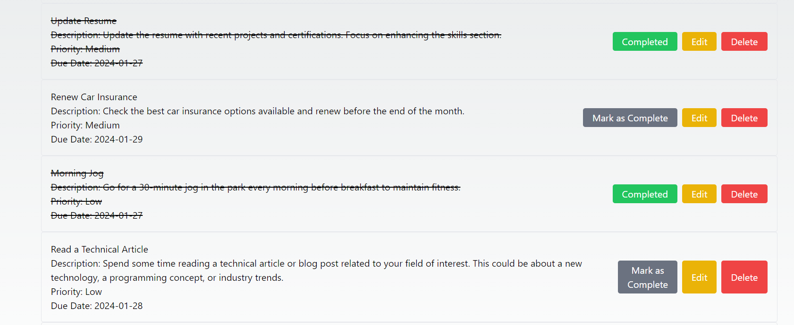

# Todo List App Frontend

[](LICENSE)
[](https://github.com/blockchaincyberpunk1/todo-list-app/stargazers)
[](https://github.com/blockchaincyberpunk1/todo-list-app/network/members)
[](https://github.com/blockchaincyberpunk1/todo-list-app/issues)
[](https://github.com/blockchaincyberpunk1/todo-list-app/pulls)

## Table of Contents

- [Todo List App Frontend](#todo-list-app-frontend)
  - [Table of Contents](#table-of-contents)
  - [Introduction](#introduction)
  - [Demo](#demo)
  - [Features](#features)
  - [Installation](#installation)
  - [Usage](#usage)
  - [Contributing](#contributing)
  - [License](#license)

## Introduction

Todo List App is a simple yet powerful tool to help you manage your daily tasks and stay organized. This React-based frontend interacts with a Node.js backend to deliver a seamless and dynamic experience.

## Demo




Explore a live demo of the Todo List App [here](https://immense-castle-11296-affffce4cc46.herokuapp.com/).


## Features

- **Task Management**: Easily add, delete, and update tasks.
- **Task Prioritization**: Assign priorities to tasks for better organization.
- **Due Dates**: Set deadlines for your tasks to ensure timely completion.
- **Responsive Design**: The app is fully responsive, making it usable on various devices.

## Installation

To run The Amazing Weather App locally, follow these installation steps:

1. Clone the repository:

   ```bash
   git clone https://github.com/blockchaincyberpunk1/todo-list-app.git
   ```

2. Navigate to the frontend directory:

   ```bash
   cd todo-list-app/client/client
   ```

3. Install dependencies:

   ```bash
   npm install
   ```

4. Start the frontend app:

   ```bash
   npm start
   ```

## Usage
After starting the app, you can add new tasks using the form provided. Tasks can be edited or marked as complete with just a click. For more details, refer to the [User Guide](docs/user-guide.md). 

## Contributing

Contributions are welcome! Please read our [Contribution Guidelines](CONTRIBUTING.md) for more information on how to report bugs, suggest enhancements, and submit pull requests.

## License

This project is licensed under the MIT License - see the [LICENSE](LICENSE) file for details.

